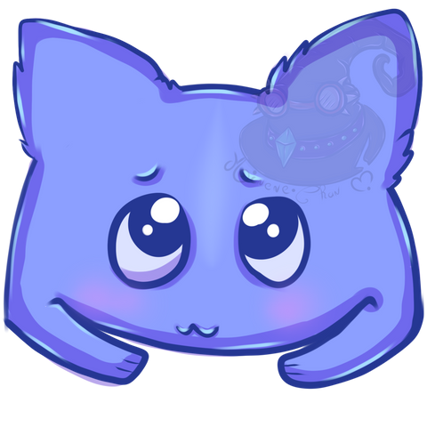

  

  

# Начинающий разработчик

Добро пожаловать на мой профиль GitHub! Я увлеченный спидранами и энтузиаст игр. Здесь вы найдете мои проекты, достижения.

  

## Кто я

- 🎮 Преданный геймер и энтузиаст
- 🌱 В настоящее время изучаю ***JavaScript***
- 💨 Занимался ранее спидранами в серии игр ***Half-Life 2***

## Также у меня есть свой сайт

На данном сайте есть несколько веб-игрушек - [Перейти](https://gaminghackintosh.ru/)

## Проекты

Некоторые из сайтов, которые я сверстал во время учебы:

- [Novel](https://github.com/GamingHackintosh/Half-life-2--Blamod)
- [Waxom-Hemepage](https://github.com/GamingHackintosh/Waxom-Hemepage-Portfolio-PSD-Template)
- [Brandi](https://github.com/GamingHackintosh/Meet-Brandi-creative-one-page-template-PSD)

## Связь со мной

-  VK: [gaminghackintosh](https://vk.com/gaminghackintosh)

-  Discord: [gamehack](https://discord.com/invite/dgxrRMsmjG)

Не стесняйтесь обращаться, если у вас есть вопросы, возможности для сотрудничества или просто хотите поболтать о скоростном беге и играх!

Счастливых вам спидранам а также удачи в программирование!

